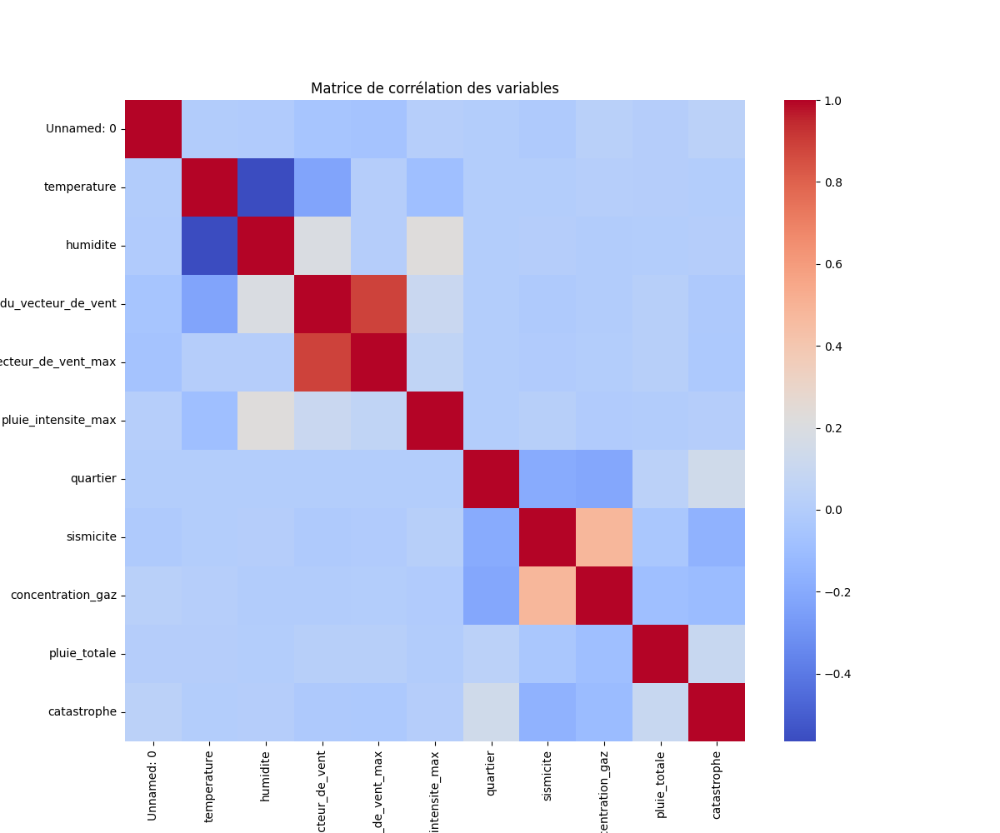
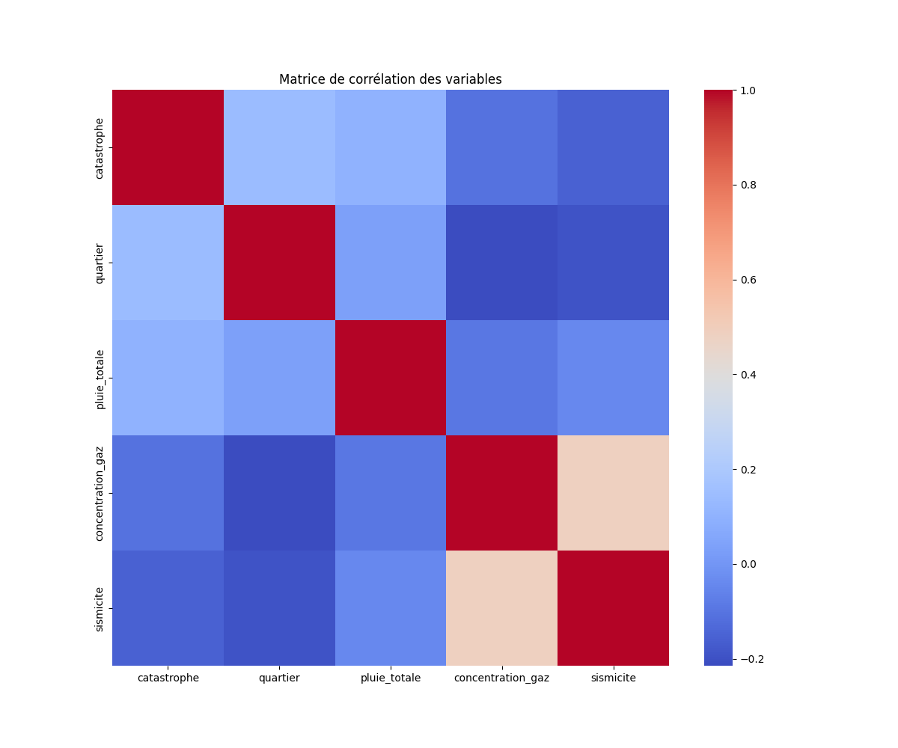
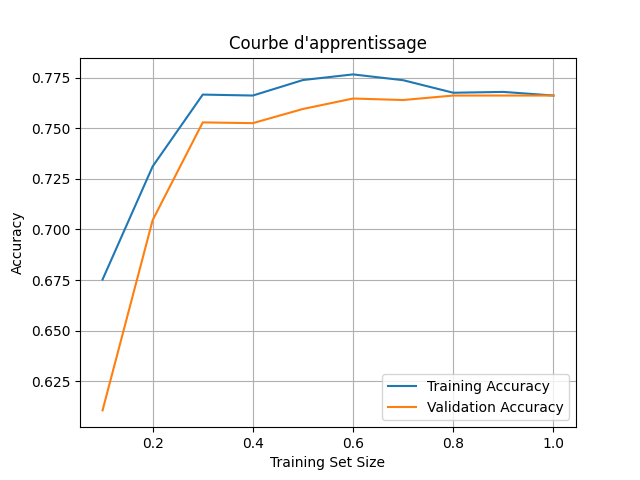
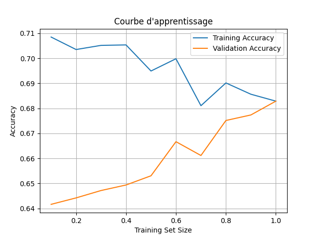
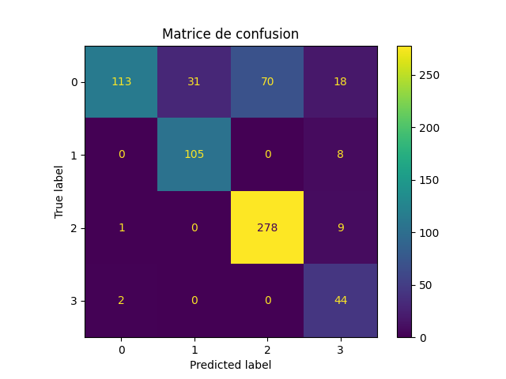
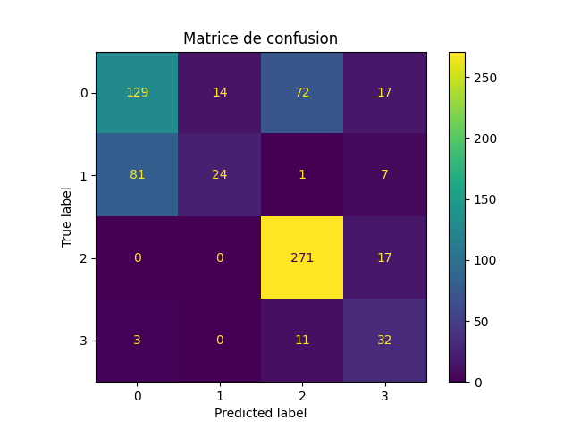
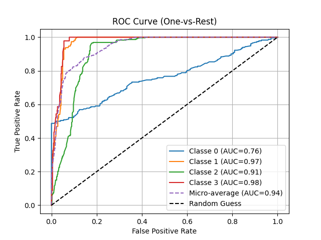

# Hackathon "La Garonne déborde !"

## Contexte du projet

En 2180, la mégapole qu'est devenue Toulouse est sujette à de violentes catastrophes naturelles qui détruisent la ville. Heureusement, un groupe d'experts en Data Science a formé une équipe pour protéger la ville des inondations, tremblements de terre, hackers et autres cataclysmes. Chaque membre de l'équipe a mis en place une solution IT pour couvrir toutes ces menaces.

## Équipe

Notre équipe est composée de 7 étudiants en Master Data Science sous le nom de **Equipe Panda Roux**. Chaque membre a contribué à une partie spécifique du projet, avec un focus particulier sur la Data Science et la mise en place de modèles de prédiction.

## Objectifs du projet

- **Nettoyer et normaliser les données fournies.**
- **Créer un modèle pour prédire les catastrophes climatiques par jour et par zone.**
- **Évaluer les performances des modèles.**
- **Intégrer les données dans une visualisation graphique.**

## Résumé des actions

### Étapes réalisées :
1. **Réduction et nettoyage des données** : Nettoyage des données de catastrophes naturelles, normalisation des valeurs et élimination des colonnes inutiles.
2. **Création de modèles prédictifs** : Un modèle basé sur des données IoT et un modèle standard avec le dataset de base.
3. **Prédiction avec les modèles** : Utilisation des modèles pour effectuer des prédictions sur des données isolées.
4. **Visualisation des résultats** : Utilisation de graphiques pour visualiser les performances des modèles (courbes d'apprentissage, matrices de corrélation, etc.).

### Modèles créés :
1. **Modèle IoT** : Prédiction des catastrophes naturelles en utilisant des données issues de capteurs IoT.
2. **Modèle Standard** : Utilisation d'un dataset de base sans capteurs IoT.

## Visualisations Générées

1. **Matrice de corrélation avant et après nettoyage des données**  
     
   

2. **Courbes d'apprentissage des modèles**  
   - Courbe d'apprentissage du modèle standard  
     
   - Courbe d'apprentissage du modèle IoT  
     

3. **Matrice de confusion des modèles**  
   - Modèle standard  
     
   - Modèle IoT  
     

4. **Courbes ROC des modèles**  
   - Modèle standard  
     
   - Modèle IoT  
     

## Colonnes utilisées pour le modèle IoT

Pour le modèle IoT, les données suivantes ont été sélectionnées et conservées :

- **date**
- **quartier**
- **humidite**
- **sismicite**
- **catastrophe**

Ces colonnes ont été choisies pour leur pertinence dans la prédiction des catastrophes naturelles, permettant d'intégrer à la fois des facteurs temporels, géographiques et environnementaux.

---

## Technologies et outils utilisés

- **Python** : Langage principal pour le traitement des données, la création des modèles et la visualisation.
- **Pandas** : Gestion et manipulation des données tabulaires.
- **XGBoost** : Algorithme de machine learning utilisé pour la création des modèles prédictifs.
- **Joblib** : Sauvegarde et chargement des modèles ML.
- **Matplotlib** : Création de visualisations graphiques.
- **Colorama** : Mise en forme des messages affichés dans le terminal.
- **Git** : Collaboration et gestion des versions du projet.

## Organisation des fichiers

Le projet est structuré en plusieurs dossiers pour faciliter l'organisation et la gestion des différentes étapes :

- **data/** : Contient les fichiers de données en entrée et sortie, comme les datasets nettoyés, les lignes isolées, et les statistiques.
- **models/** : Contient les modèles de machine learning entraînés.
- **docs/** : Contient les visualisations générées, telles que les courbes ROC, les matrices de confusion et les courbes d'apprentissage.
- **scripts/** : Regroupe les scripts Python pour chaque étape du projet :
  - `cleanig_data_script.py` : Pour nettoyer et préparer les données.
  - `ML_model_training_script.py` : Pour entraîner les modèles de machine learning.
  - `prediction_script.py` : Pour effectuer les prédictions avec les modèles.
  - `visualisation_script.py` : Pour générer des visualisations.
- **main.py** : Script principal pour exécuter les étapes du projet.

## Fonctionnalités principales

1. **Nettoyage des données**  
   - Mapping des colonnes catégoriques (`catastrophe`, `quartier`) avec des valeurs numériques.  
   - Normalisation de l'humidité et gestion des valeurs manquantes.  
   - Création d'un dataset dédié au modèle IoT avec des colonnes spécifiques.

2. **Visualisations**  
   - Matrices de corrélation avant et après nettoyage.  
   - Courbes d'apprentissage des modèles pour analyser leur performance.  
   - Matrices de confusion pour évaluer la précision des prédictions.  
   - Courbes ROC pour analyser les compromis entre sensibilité et spécificité.

3. **Entraînement des modèles**  
   - Modèle standard : Basé sur le dataset complet.  
   - Modèle IoT : Conçu avec un sous-ensemble de colonnes pour refléter les données des capteurs.  

4. **Prédiction**  
   - Utilisation de modèles entraînés pour prédire les catastrophes naturelles à partir de données nouvelles ou isolées.  

## Exécution du projet

1. **Cloner le projet :**
   ```bash
   git clone <repository_url>
   cd 123PandaRoux
   ```

2. **Installer les dépendances :**
   ```bash
   pip install -r requirements.txt
   ```

3. **Lancer le programme :**
   ```bash
   python main.py
   ```

4. **Naviguer parmi les options du programme**  
   Choisissez une ou plusieurs étapes à exécuter (exemple : `1,2,3`), ou appuyez sur Entrée pour tout exécuter.
