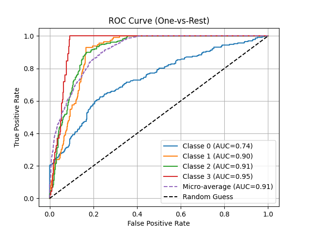

Voici un canevas pour le README de votre projet de hackathon "La Garonne déborde!" incluant les détails de votre équipe, les tâches effectuées, et les résultats visuels générés pendant le projet. 

---

# README - Hackathon "La Garonne déborde !"

## Contexte du projet

En 2180, la mégapole qu'est devenue Toulouse est sujette à de violentes catastrophes naturelles qui détruisent la ville. Heureusement, un groupe d'experts en Data Science a formé une équipe pour protéger la ville des inondations, tremblements de terre, hackers et autres cataclysmes. Chaque membre de l'équipe a mis en place une solution IT pour couvrir toutes ces menaces.

## Équipe

Notre équipe est composée de 7 étudiants en Master Data Science sous le nom de **Equipe Panda Roux**. Chaque membre a contribué à une partie spécifique du projet, avec un focus particulier sur la Data Science et la mise en place de modèles de prédiction.

## Objectifs du projet

- **Nettoyer et normaliser les données fournies.**
- **Créer un modèle pour prédire les catastrophes climatiques par jour et par zone.**
- **Évaluer les performances des modèles.**
- **Intégrer les données dans une visualisation graphique.**

## Résumé des actions

### Étapes réalisées :
1. **Réduction et nettoyage des données** : Nettoyage des données de catastrophes naturelles, normalisation des valeurs et élimination des colonnes inutiles.
2. **Création de modèles prédictifs** : Un modèle basé sur des données IoT et un modèle standard avec le dataset de base.
3. **Prédiction avec les modèles** : Utilisation des modèles pour effectuer des prédictions sur des données isolées.
4. **Visualisation des résultats** : Utilisation de graphiques pour visualiser les performances des modèles (courbes d'apprentissage, matrices de corrélation, etc.).

### Modèles créés :
1. **Modèle IoT** : Prédiction des catastrophes naturelles en utilisant des données issues de capteurs IoT.
2. **Modèle Standard** : Utilisation d'un dataset de base sans capteurs IoT.

## Visualisations Générées

1. **Matrice de corrélation avant et après nettoyage des données**  
     
   

2. **Courbes d'apprentissage des modèles**  
   - Courbe d'apprentissage du modèle standard  
     
   - Courbe d'apprentissage du modèle IoT  
     

3. **Matrice de confusion des modèles**  
   - Modèle standard  
     
   - Modèle IoT  
     

4. **Courbes ROC des modèles**  
   - Modèle standard  
     
   - Modèle IoT  
     

## Colonnes utilisées pour le modèle IoT

Pour le modèle IoT, les données suivantes ont été sélectionnées et conservées :

- **date**
- **quartier**
- **humidite**
- **sismicite**
- **catastrophe**

Ces colonnes ont été choisies pour leur pertinence dans la prédiction des catastrophes naturelles, permettant d'intégrer à la fois des facteurs temporels, géographiques et environnementaux.

---

N'hésitez pas à adapter ce canevas en fonction des détails spécifiques ou des modifications que vous souhaiteriez apporter au projet.